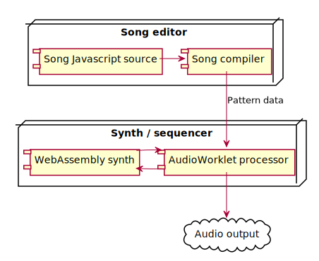

Webassembly synth
=================

The synthesizer itself is written in [AssemblyScript](https://assemblyscript.org), and contains simple oscillators, filters, delay, reverb and more. It also contains a simple pattern sequencer with the same structures as in [4klang](../4klang/), and so you can use the same javascript API when programming music. The difference is though when it comes to defining instruments as you have the full flexibility of writing the code as can be seen in the examples here [synth1/assembly/instruments](synth1/assembly/instruments). You'd also have to build a mix for your song as can be seen in the [synth1/assembly/mixes](synth1/assembly/mixes) folder, and also reference it from [synth1/assembly/index.ts](synth1/assembly/index.ts).

A synth WebAssembly module is small, and the current examples typically less than 16kb. By embedding the pattern data in the WASM, you can create tiny webapps or executables playing music.

[AudioWorklet](https://developer.mozilla.org/en-US/docs/Web/API/AudioWorklet) is used for playing music on the web with low latency, and this is currently only supported for the Chrome web browser. I've written a [polyfill](audioworkletpolyfill.js) for being able to play in other browsers, but you don't get the low latency.

More about the Javascript API coming soon, but you'll find examples to study in the [synth1/songs](synth1/songs) folder, and there are also my [gists](https://gist.github.com/petersalomonsen). You can easily load music from a gist by referencing to it in the URL, e.g.:

https://petersalomonsen.com/webassemblymusic/livecodev1/?gist=ea73551e352440d5f470c6af89d7fe7c

# Build / Run / Export to WAW

**Build**:
from the [synth1](synth1) folder:

`npm run asbuild` (for optimized build)

`npm run fastbuild` (for faster build and wat file)

**Run**:

`node webserver.js`

Browse to http://localhost:5000

**Export to wav**:

from the [synth1](synth1) folder.

the [synth1/index.js](synth1/index.js) script will output audio to `stdout`, so you may pipe it into e.g. [SoX]([sox](http://sox.sourceforge.net/)) like this:

`node index.js | sox -S -t raw -b 32 -e float -r 44100 -c 2 - out.wav`

